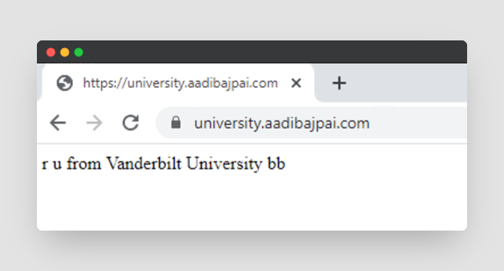

# university request detection proof of concept

find catchier title maybe

should detect university if you visit this from a university

imagine if I had this last year during college application szn

## API

URL: https://uni.aadibajpai.workers.dev

*status code 200* with university name as text body if found.

Else, *404 not found*

Eg. `{status: 200, "Columbia University"}` or `{status: 404, "not found"}`

No rate limits or anything, go wild. Okay, Cloudflare Workers have a limit of 100,000 requests a day so maybe keep that into account.

For requests made through a backend, you can pass the IP address in a `x-lookup-ip` header.

API source code: https://github.com/aadibajpai/university-worker

## Example Usage

See [index.html](index.html)

I set it up for [my website](https://aadibajpai.com) too as a possible implementation to slightly modify text if
a university visitor is detected. 

Look at that [here](https://github.com/aadibajpai/my-website/blob/721a8493c020cbed14fd875deec2714b53126af1/index.html#L341-L355).

## Why?

I thought about this last year while doing college applications. Was easier to implement than I expected and fun. 
I think it has potential.

## Isn't this overkill?

no u

---

Thanks to my friend [Nisala](https://github.com/nkalupahana) for help with making and testing this <3
